<div align="center">

  <!-- Hero -->
  

  <!-- Social Links (bigger, centered, wrapped) -->
  <div style="display: flex; justify-content: center; gap: 20px; margin: 25px 0; flex-wrap: wrap;">
    <a href="https://twitter.com/Itz_IshanSingla"></a>
    <a href="https://www.linkedin.com/in/itzishansingla/"></a>
    <a href="https://ishansingla.me/"></a>
    <a href="https://www.youtube.com/@IshanSingla"></a>
    <!-- Uncomment if active --> 
    <!-- <a href="https://twitch.tv/yourtwitch"></a> -->
  </div>

  <h1>🌟 ISHAN SINGLA 🌟</h1>
  <h3>Backend & MLOps Engineer | Cloud & DevOps Sorcerer | 23 | India 🇮🇳</h3>

  <p>🚀 Behold! A Phenomenal Technologist | Mastermind Backend Developer | Cloud Enthusiast Extraordinaire</p>

</div>

---

### 👨‍💻 About Me
- 💫 Currently weaving magic as **MLOps Python Backend Engineer** at **Finvasia Securities Pvt Ltd** — building reliable ML pipelines, scalable APIs & cloud infra
- 🧑‍💻 Previously: **Full-Stack Engineer** at **Bajaj Finserv Health** (7 months) — end-to-end product features & delivery
- 🎓 B.Tech from **Chitkara University, Punjab**
- ⚡ Always ready to summon solutions!
- 💬 Ask me anything — I am the oracle you seek
- ⚡️ Fun-Fact: I'm the undisputed **Noob King** (who still ships to production 😈)
- 🔭 Deep into **MLOps**, Kubernetes, serverless, Go, FastAPI & NestJS

---

### 🛠️ Tech Stack Alchemy

**Languages**  


**Backend & Frameworks**  


**Databases & Stores**  


**Cloud & Serverless**  


**DevOps & Tools**  


**Frontend & Mobile**  


---

### 💼 Professional Journey
Transcending the mundane, I ascended to the divine realms of backend sorcery, embracing the cosmic powers of cloud computing and DevOps. Mastery attained in the sacred arts of **AWS** (Lambda, ECS, Fargate), Kubernetes, and more.

- Pivotal internship with **DRDO** — contributed to cutting-edge defense projects
- Full-Stack Engineer @ **Bajaj Finserv Health** (7 months)
- Current: MLOps Python Backend Engineer @ **Finvasia Securities Pvt Ltd**

---

### 🏆 Awards & Recognition
A maestro in hackathons, claiming the zenith in competitions orchestrated by **Punjab University** and **Yamaha**. These conquests not only honed my problem-solving acumen but also showcased my unparalleled ability to thrive in the crucible of competitive tech environments.

---

### 📊 GitHub & Coding Stats

<div align="center">
  
  <br>
  
  <br>
  <br>
  <br>
  
</div>

### 👨🏻‍💻 WakaTime (Coding Pulse)
<!--START_SECTION:waka-->

```txt
Total Time: 568 hrs 43 mins

TypeScript                 351 hrs 8 mins  ⣿⣿⣿⣿⣿⣿⣿⣿⣿⣿⣿⣿⣿⣿⣿⣦⣀⣀⣀⣀⣀⣀⣀⣀⣀   61.74 %
JSON                       36 hrs          ⣿⣦⣀⣀⣀⣀⣀⣀⣀⣀⣀⣀⣀⣀⣀⣀⣀⣀⣀⣀⣀⣀⣀⣀⣀   06.33 %
Dart                       31 hrs 51 mins  ⣿⣤⣀⣀⣀⣀⣀⣀⣀⣀⣀⣀⣀⣀⣀⣀⣀⣀⣀⣀⣀⣀⣀⣀⣀   05.60 %
JavaScript                 24 hrs 34 mins  ⣿⣀⣀⣀⣀⣀⣀⣀⣀⣀⣀⣀⣀⣀⣀⣀⣀⣀⣀⣀⣀⣀⣀⣀⣀   04.32 %
Prisma                     18 hrs 49 mins  ⣷⣀⣀⣀⣀⣀⣀⣀⣀⣀⣀⣀⣀⣀⣀⣀⣀⣀⣀⣀⣀⣀⣀⣀⣀   03.31 %
```

<!--END_SECTION:waka-->

---

### 📋 Badges
[](https://holopin.io/@ishansingla)

---

### 💻 Latest Activities
<!--START_SECTION:activity-->
<!--END_SECTION:activity-->

---

### 🌐 Next Chapter
Armed with an arsenal of diverse skills and real-world enchantments, I stand poised for the next transcendental phase. Eager to contribute to groundbreaking projects, I navigate the ever-evolving tech cosmos with unwavering resolve.

---

### 🤝 Let's Connect & Conjure the Future!
Open to mystical discussions on collaboration, new opportunities, MLOps/backend roles, hackathons, or just geeking out.

<p align="center">
  <a href="mailto:is.ishan.singla@gmail.com"></a>
  <a href="https://linkedin.com/in/itzishansingla"></a>
  <a href="https://twitter.com/Itz_IshanSingla"></a>
  <a href="https://instagram.com/Itz_IshanSingla"></a>
  <a href="https://github.com/IshanSingla"></a>
  <a href="https://www.youtube.com/@IshanSingla"></a>
  <a href="https://www.hackerrank.com/ishansingla"></a>
  <a href="https://www.leetcode.com/ishansingla"></a>
</p>

<p align="center">
  🚀 Ready to build something legendary? Drop a message — let's make magic happen!
</p>